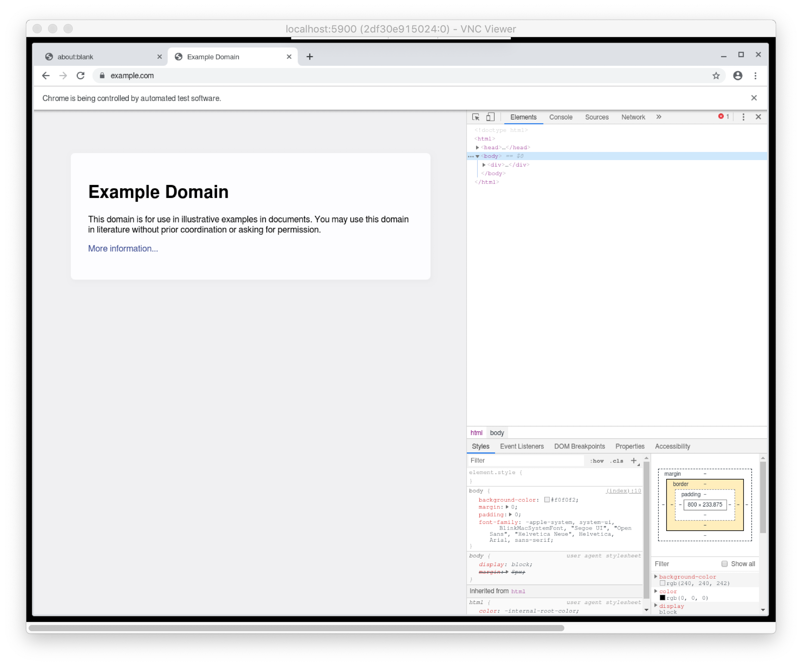

### docker + puppeteer

Because debugging puppeteer things inside docker container is tricky.

#### Run container

```
yarn
yarn docker
```

#### Connect to it with vnc

Mac default vnc didn't work for me, but for example this one did https://www.realvnc.com/en/


